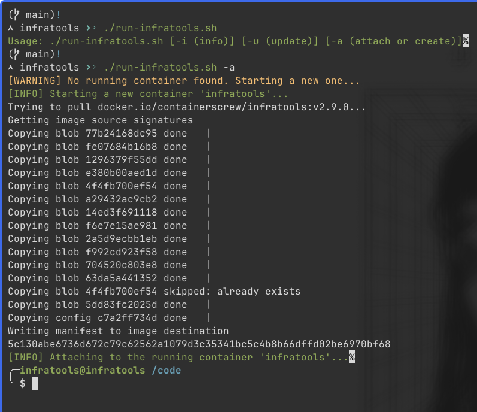

<p align="center" >
    
<h3 align="center">infratools</h3>
<p align="center">Container image with infra tools (terraform, terragrunt, aws cli, helm, kubectl...). Useful for CI/CD.</p>
</p>

<!-- START doctoc generated TOC please keep comment here to allow auto update -->
<!-- DON'T EDIT THIS SECTION, INSTEAD RE-RUN doctoc TO UPDATE -->
**Table of Contents**  *generated with [DocToc](https://github.com/thlorenz/doctoc)*

- [Badges](#badges)
- [About](#about)
- [Available tools](#available-tools)
  - [Versioning](#versioning)
  - [Dynamically change terraform version](#dynamically-change-terraform-version)
- [Architecture](#architecture)
- [Running locally](#running-locally)
- [Example](#example)
- [TO DO](#to-do)
- [CHANGELOG](#changelog)
- [LICENSE](#license)

<!-- END doctoc generated TOC please keep comment here to allow auto update -->

# Badges


[](/LICENSE)


[](https://hub.docker.com/r/containerscrew/infratools/)


#  About

How many times do you need a container image with tools like `terraform, helm, kubectl, aws cli, terragrunt`... among many others? Aren't you tired of having to maintain all of them in each repository, instead of having one **"general"** one that can be used in multiple repos?

**Available tags:** https://hub.docker.com/repository/docker/containerscrew/infratools/general 

# Available tools

| Tool                                                 | Available |
|------------------------------------------------------|----------|
| Terraform                                            |   ✅      |
| Terragrunt                                           |   ✅      |
| Kubectl                                              |   ✅      |
| Helm                                                 |   ✅      |
| AWS CLI                                              |   ✅      |
| [tftools](https://github.com/containerscrew/tftools) |   ✅      |
| [tfenv](https://github.com/tfutils/tfenv)   |   ✅      |

## Versioning

> Alpine core packages: https://pkgs.alpinelinux.org/packages

> AWS cli v2 is installed directly from official alpine repository. If you need to look for other version, [visit this page](https://pkgs.alpinelinux.org/packages?name=aws-cli&branch=edge&repo=&arch=&maintainer=)

> For every new version, a new git tag will be created. You can see versioning inside [Containerfile](./Containerfile)

## Dynamically change terraform version

> [!TIP]
> By default, a version of terraform is installed using `tfenv`. If you have the `.terraform-version` file in your `terraform/terragrunt` repository, `tfenv` should detect the version and install it automatically.


Or change it yourself, for example, within a pipeline:

```shell
tfenv use 1.5.5
```

# Architecture

| Arch    | Supported | Tested |
|---------|----------|--------|
| amd64   | ✅        | ✅        |
| arm64   | ✅         | ✅         |


# Running locally

```shell
podman run --rm -it --name infratools docker.io/containerscrew/infratools:v1.4.1
```

> Use the version([tag](https://github.com/containerscrew/infratools/tags)) you need.

# Example



# TO DO 

* Add also tag `latest` in docker hub images.
* Add other dynamic version switchers for other tools (tgswitch, kubectl...)
* Automatic pipeline cron with image scan & automatic build

# CHANGELOG

Pending to add changelog to track every new git tag is created, which versions are included.

# LICENSE

[LICENSE](./LICENSE)